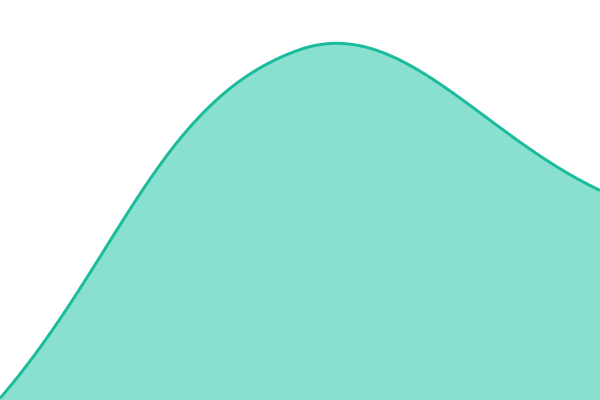
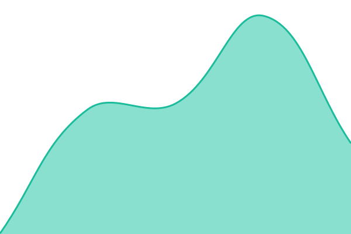

# [📈 Live Status](https://status.domilia.ca): <!--live status--> **Tous les systèmes sont opérationnels**

This repository contains the open-source uptime monitor and status page for [Domilia-project](https://status.domilia.ca), powered by [Upptime](https://github.com/upptime/upptime).

With [Upptime](https://upptime.js.org), you can get your own unlimited and free uptime monitor and status page, powered entirely by a GitHub repository. We use [Issues](https://github.com/Domilia-project/status/issues) as incident reports, [Actions](https://github.com/Domilia-project/status/actions) as uptime monitors, and [Pages](https://status.domilia.ca) for the status page.

<!--start: status pages-->
<!-- This summary is generated by Upptime (https://github.com/upptime/upptime) -->
<!-- Do not edit this manually, your changes will be overwritten -->
<!-- prettier-ignore -->
| URL | Status | History | Temps de réponse | Disponibilité |
| --- | ------ | ------- | ------------- | ------ |
|  [Site web](https://www.domilia.ca) | En service | [site-web.yml](https://github.com/Domilia-project/status/commits/HEAD/history/site-web.yml) | 

 200ms
     
 | 

<a href="https://status.domilia.ca/history/site-web">100.00%</a>
    

|  [Application](https://app.domilia.ca) | En service | [application.yml](https://github.com/Domilia-project/status/commits/HEAD/history/application.yml) | 

 215ms
     
 | 

<a href="https://status.domilia.ca/history/application">100.00%</a>
    

|  [API](https://api.domilia.ca/health) | En service | [api.yml](https://github.com/Domilia-project/status/commits/HEAD/history/api.yml) | 

 241ms
     
 | 

<a href="https://status.domilia.ca/history/api">100.00%</a>
    

|  [Signature électronique](https://app.domilia.ca/signature) | En service | [signature-electronique.yml](https://github.com/Domilia-project/status/commits/HEAD/history/signature-electronique.yml) | 

 135ms
     
 | 

<a href="https://status.domilia.ca/history/signature-electronique">100.00%</a>
    

<!--end: status pages-->

[**Visit our status website →**](https://status.domilia.ca)

## 📄 License

- Powered by: [Upptime](https://github.com/upptime/upptime)
- Code: [MIT](./LICENSE) © [Anand Chowdhary](https://anandchowdhary.com)
- Data in the `./history` directory: [Open Database License](https://opendatacommons.org/licenses/odbl/1-0/)
